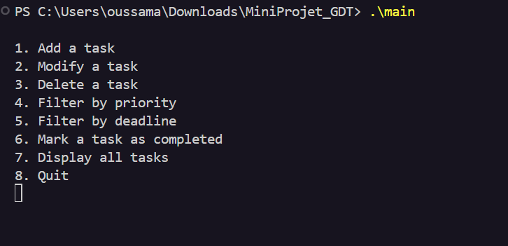

# How to run your code
## step1
#### Compile the helpers.c file to create an object file: 
"gcc -c -o helpers.o helpers.c".
## step2
#### Create a static library (helpers.a) from the object file: 
"ar rcs helpers.a helpers.o"
## step3
#### Compile the main.c file, linking it with the static library: 
"gcc -o main main.c helpers.a"
## step4
#### Finally, execute the compiled main executable: 
"./main"
## This is the interface

